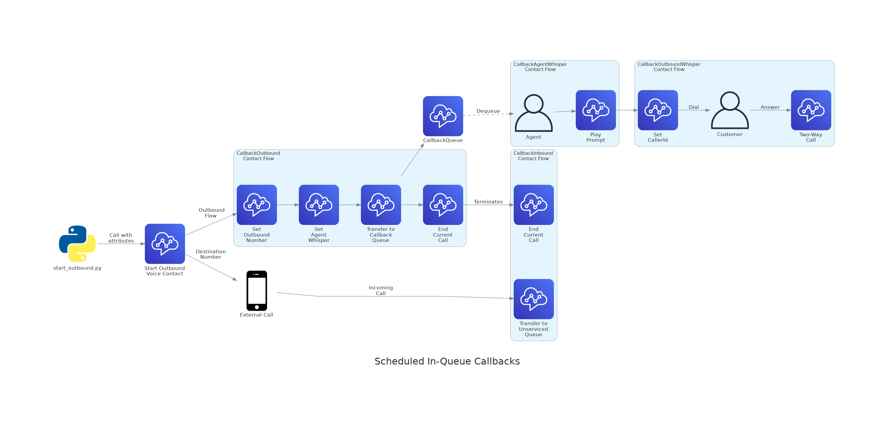

# siqc
Scheduled In-Queue Callbacks

## Problem Definition

### Callbacks

For the purpose of this prototype, a `callback` is determined to be an outbound call to a customer which has been expressly requested by the customer at a particular point in time (approximately). This is different from any form of "cold-call" or sales contacts.

We group these into two categories:
* `queued` or `in-queue` callbacks which have been requested "as soon as possible".  These are offered out-of-the-box in Amazon Connect, and explained in more detail below.
* `scheduled` callbacks which have been requested for a particular point in time, e.g. "please call me back at 5pm tomorrow". Amazon provides a good starting place for creating these, TODO, but it has one significant limitation.

### Start Outbound Voice Contact

Presently, there is only one method to programmatically dial an external phone number from Amazon Connect: the [StartOutboundVoiceContact](https://docs.aws.amazon.com/connect/latest/APIReference/API_StartOutboundVoiceContact.html) API.  It works as follows:

Unfortunately it has one large problem: because it will only connect an agent *after* the customer has already answered, there will be a noticable delay between the two. In this time:
* The customer may hang up before the agent can explain the reason for the call
* The call may hit a voicemail which is shorter than the delay, resulting in the agent leaving an awkward message for the customer

This behaviour is likely intentional as it fits a more normal "outbound" paradigm, where the expectation is that relatively few calls will be answered, and the benefit of reduced agent handle time outweighs the cost to customer experience.

Considering that these scheduled callbacks are actually requested by the customer, though, our requirements are different: we'd prefer to offer a better experience to the customer, even if it means holding up the agent while we dial.

### In-Queue Callbacks

There is an [in-built form of callback](https://docs.aws.amazon.com/connect/latest/adminguide/setup-queued-cb.html) offered by Amazon Connect, which we refer to as `queued` or `in-queue` callbacks.  Unlike scheduled callbacks these are designed to be immediate, and specifically offered to customers to avoid waiting in long queues.

As these callbacks sit in a queue, they behave like any reqular inbound call, except that the customer is not currently on the line.  Instead, it waits in the queue until an agent is ready to accept it, and only after they've done so does it dial the outbound number.  As such the agent is available to greet the customer immediately after they answer.

Unfortunately, there is no way to programmatically trigger the creation of such a callback: it can only be done as part of an inbound contact flow, triggered from a phone call.

## Design Overview

### Assumptions

This prototype assumes that you already have some mechanism to:
* Receive a request for a scheduled callback
* Store the callback details
* Automatically trigger an event when the time expires

The prototype represents the continuation of the third step, i.e. when the event fires it will create a scheduled "in-queue" callback.

### Detail

In general, the prototype creates an *outbound* call to an *inbound* number, and uses that inbound contact flow to create the in-queue callback.  Specifically:

* A start-script, designed to be triggered from the expiration event, does the following:
  * Pushes the relevant callback details to an SQS queue
  * Starts an outbound voice contact:
    * `Destination` = an inbound phone number in the connect instance, which points to the `CallbackInbound` flow
    * `ContactFlow` = the `CallbackOutbound` flow.
* Both sides of the call run simultaneously:
  * `CallbackOutbound`
    * Simply transfer to a queue that no agent is servicing
    * Wait here until the "customer" disconnects (see below)
  * `CallbackInbound`
    * Calls the lambda to pop the callback details from an SQS queue and return them
    * Sets the outbound number, as provided in the callback details
    * Creates an in-queue callback and transfers to the callback queue
    * Terminates the current call, which also ends the outbound side

From here, the behaviour is the same as an in-queue callback, i.e. an agent servicing the callback queue will pick it up and only then will the system dial the customer.

### Limitations

## Requirements

### Testing
* python3
* global pipenv

### Developing
* graphviz

## Running

Update the file at deploy/.env

TODO: init.sh

1. pipenv install
1. pipenv shell
1. python -m deploy.deploy

## Explanation

## Notes

* Deleting flow stack requires unassigning number

## TODO

* Teardown script
  * Remove user from RP DONE
  * Undo associations DONE
  * Delete stacks?
* Set some attributes on contact that make it clear what it is
* Update default agent whisper
* ruff format and mypy pre-push hooks DONE
* No unused (except with leading underscore) DONE
* Proper docstrings
* Unit tests